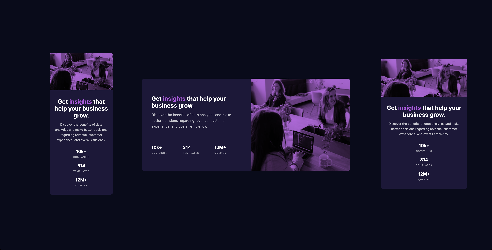

# Frontend Mentor - Stats preview card component

## Welcome! 👋

This is a solution to the [Stats preview card component challenge on Frontend Mentor](https://www.frontendmentor.io/challenges/stats-preview-card-component-8JqbgoU62). Frontend Mentor challenges help you improve your coding skills by building realistic projects. 

## Table of contents

- [The challenge](#the-challenge)
- [Screenshot](#screenshot)
- [Links](#links)
- [My process](#my-process)
  - [Built with](#built-with)
- [Author](#author)

### The challenge

Your challenge is to build out this card component and get it looking as close to the design as possible.

You can use any tools you like to help you complete the challenge. So if you've got something you'd like to practice, feel free to give it a go.

Your users should be able to:

- View the optimal layout depending on their device's screen size

### Screenshot

### Links

- Solution URL: [Add solution URL here](https://your-solution-url.com)
- Live Site URL: [Add live site URL here](https://captkraken.github.io/stats-preview-card-component/)

## My process
in this challenge, i chose the mobile-first route. im getting the hang of it now. i used flexbox for the layout. 

i encountered a problem with the image – beign it changes the image for mobile and desktop. the solution i came up with was to create a decoy image and put the opacity to 0. then i created a div with the class overlay where i change the background image based on the view port. that seems to solve the problem.

before coming to that solution, however, i thought of putting two images then hide one for different viewports, but it would be unnecessary to download the desktop version when it's open from a mobile device.
### Built with

- Flexbox
- Mobile-first workflow

## Author

- Website - [CaptKraken](https://github.com/CaptKraken)
- Frontend Mentor - [@CaptKraken](https://www.frontendmentor.io/profile/CaptKraken)
